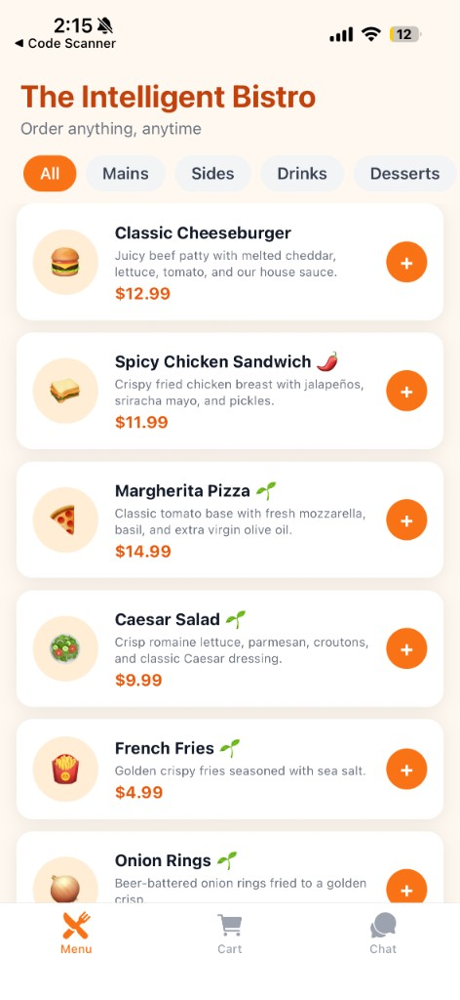

# 🍔 Intelligent Bistro

**AI-powered restaurant ordering — chat with your menu, watch your cart update in real time.**

---

## 📽️ Demo

[📽️ Watch 5-min demo](https://www.loom.com/share/2860cb57ba8b4e779efac03a3efa0118)

---

## 📸 Screenshots

| Menu (Browse items) | Chat (AI conversation) | Cart (Order summary) |
| :---: | :---: | :---: |
|  | <br><br>*(Add Chat screenshot here)*<br><br> | <br><br>*(Add Cart screenshot here)*<br><br> |

---

## ✅ What it does

- Browse a 10-item bistro menu with categories, sizes, and modifiers
- Manage cart via UI: add, remove, quantity controls, totals with tax
- Chat with AI in plain English; multi-operation, context-aware, structured JSON outputs
- Polished mobile UX: haptics, animations, typing indicators, badge counts

---

## 🛠 Tech stack

| Layer | Tech |
|-------|------|
| Mobile | React Native + Expo Router + NativeWind v4 + Zustand + Gifted Chat + Reanimated |
| Backend | Node.js + Express + TypeScript |
| AI | Groq (Llama via OpenAI-compatible structured outputs) via Vercel AI SDK |
| Validation | Zod (single source of truth for AI response shape) |
| Deploy | Render (backend), Expo Go (mobile dev) |

---

## 🏗 Architecture

```
User → Chat tab → POST /api/chat → Express
                                      ↓
                        Vercel AI SDK + Zod schema
                                      ↓
                                   Groq LLM
                                      ↓
                              Structured JSON
                                      ↓
                          Apply to Zustand cart
                                      ↓
                                UI re-renders
```

---

## 🔑 Key technical decisions

- **Structured outputs over regex** — Zod schema is the contract between AI and app. AI cannot return invalid JSON.
- **Provider-agnostic via Vercel AI SDK** — swapping Groq → OpenAI → Anthropic is a 1-line change.
- **Single source of truth** — `CartOperationSchema` is consumed by AI, server validation, and client.
- **History compaction** — older turns summarized into a synthetic system message + live cart state, keeping prompt under 4KB regardless of conversation length.
- **Optimistic UI** — Cart updates immediately on operation receipt; no spinner.

---

## 🚀 Local setup

```bash
git clone https://github.com/Vasu2604/intelligent-bistro.git
cd intelligent-bistro

# Backend
cd server && npm install
cp .env.example .env  # add GROQ_API_KEY from console.groq.com
npm run dev  # :3000

# Mobile (new terminal)
cd ../app && npm install
npx expo start  # scan QR with Expo Go
```

---

## 🤖 AI tooling in development

- **Claude Code (Anthropic)** — scaffolding, debugging dependency issues, structured prompt engineering
- **Cursor** — iterative edits and refactors
- **Build time:** ~2 days

---

## 🔭 What I'd add with more time

- Voice input via `expo-speech` + Groq Whisper
- Order persistence with PostgreSQL
- Streaming AI replies for snappier feel
- Order placement flow with Stripe
- Unit tests on cart store + AI route + schema validation

---

## 📄 License

MIT
